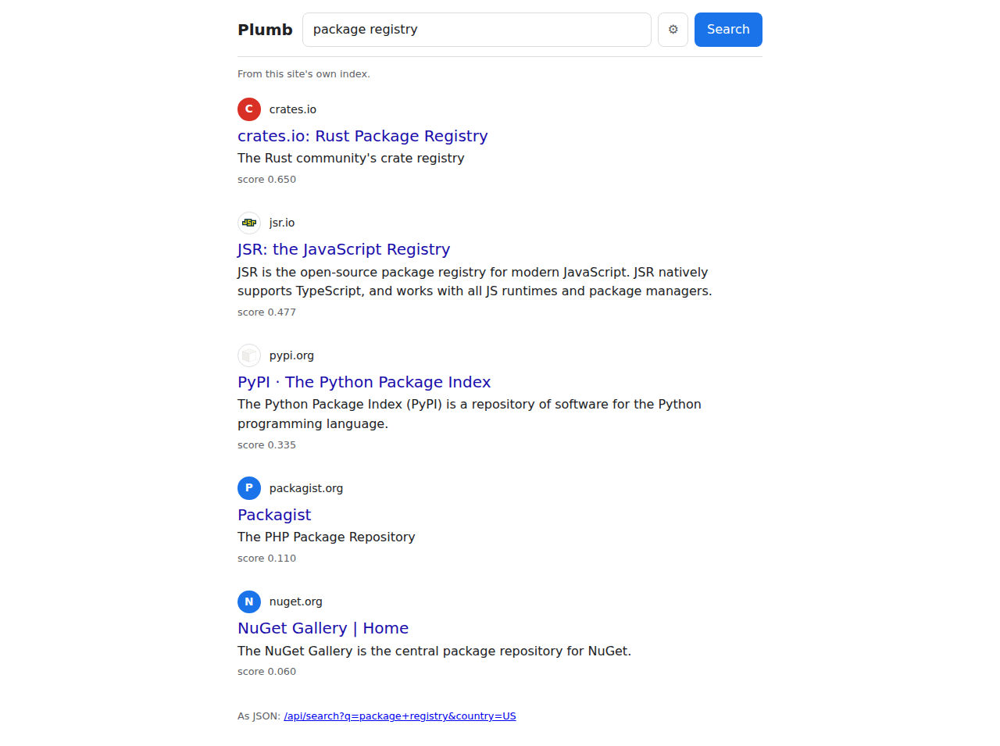

# Plumb Search

Plumb Search is a free, open-source, fully hackable search engine, and free web search for AI apps and local models. It needs no API key and has no quota. It doesn't scrape Google, Bing or anyone else: it answers from its own index, so there is no engine upstream to block or throttle it. It speaks SearXNG's JSON API and MCP, so it drops into the setup you already have:

```sh
claude mcp add --transport http plumb https://plumbsearch.org/mcp
```

or give any app that takes a SearXNG address `https://plumbsearch.org` (`/search?q=<query>&format=json`).

Search at **[plumbsearch.org](https://plumbsearch.org)**, or run your own node on a homelab server or a desktop so your searches stay with you. Nodes share their crawling with each other over a peer-to-peer network, so nobody has to crawl the whole web alone.

Type "us bank" and usbank.com comes first. Plumb indexes sites, not every page: for each site it keeps its names, homepage title, description and key terms, the words other sites use when they link to it, and its Wikidata description, kind and country, about 1 KB per site, so a million sites fit in roughly a gigabyte. Next to sites it lists single pages from open page sets (Wikipedia, GitHub, Stack Overflow, software packages, books and papers) and places from OpenStreetMap. Results are matched by words and by meaning, then put in order by a small ranking model trained on test searches.



- [Try it](#try-it)
- [What it does](#what-it-does)
- [Run your own node](#run-your-own-node)
- [Fully hackable](#fully-hackable)
- [Use it from an AI](#use-it-from-an-ai)
- [How it works](#how-it-works)
- [Status](#status)
- [Contributing](#contributing)
- [Data sources](#data-sources)
- [License](#license)

## Try it

Search at https://plumbsearch.org. It keeps no access log, and its results pages load nothing from other servers: site icons are served by Plumb itself, and maps are drawn from coordinates rather than map tiles.

To make it your browser's search engine, open a Plumb page and add it from the address bar (in Firefox, right-click the address bar and choose **Add "Plumb Search"**), or add `https://plumbsearch.org/search?q=%s` by hand.

## What it does

- **Official sites first.** Names outrank text, and look-alike sites stuffed with a brand's keywords are kept below the real one.
- **Page sets.** English Wikipedia articles, well-starred GitHub repositories, the most viewed questions of Stack Overflow and 33 other Stack Exchange sites (Super User, Home Improvement, Travel and more), Open Library's most read books, Podcast Index's most popular podcasts and the most cited papers, shown next to sites. Only titles, short descriptions and page views are kept, no article text ([docs/pages.md](docs/pages.md)).
- **Instant answers and info boxes**: sums, unit and currency conversions and the time in a place, a box about the person, place or thing searched for, and profiles linking to its official accounts.
- **Sitelinks**: links to a site's key pages, such as its Log in page, under the official site.
- **Recent headlines** from the RSS and Atom feeds sites publish, in a folded "Recent" block ([docs/news.md](docs/news.md)).
- **Places**: "pizza in denver" or "coffee near me" lists places from OpenStreetMap with a small map ([docs/places.md](docs/places.md)).
- **Search operators** (`site:`, `-site:`, `"exact words"`, `-word`), **safe search** and **language** filters, and pages that are only a bot check left out of results.
- **Search by meaning**: "electric car maker" finds sites that never use those words. On in the desktop app and the Docker image; `plumb run --search-by-meaning` elsewhere.
- **Private search**: a `/private` page where the browser fetches padded buckets of sites and ranks them itself, so the node never sees the query ([docs/private-search.md](docs/private-search.md)).
- **Plugins** (optional): a node's owner can add results from sources Plumb does not crawl, such as a site's own search API, with plugins written in Rust and run in a WebAssembly sandbox. Nodes come with none ([docs/plugins.md](docs/plugins.md)).
- **About you**: each browser can give its city and list interests, sites it always wants first and sites it never wants to see, kept on its own node (or, on a public server, in the browser) and never sent with a search. New searchers are invited to a short welcome page that asks for them.

There are no ads and no tracking. Plumb does not crawl the full text of the web: for each site it fetches the homepage, robots.txt and the site's icon, and for the best-ranked sites their RSS or Atom feed. Key pages for sitelinks are picked from the homepage's links, not fetched. It obeys robots.txt.

## Run your own node

A node serves the same search page, keeps crawling homepages, and joins the Plumb network by default. A new node copies the best sites of a node it trusts (plumbsearch.org by default) and is searchable within a few minutes. No port forwarding is needed.

**Server or homelab** ([docs/docker.md](docs/docker.md)): the image is published as `ghcr.io/sueheir/plumb-search`. Use `:0.2` to stay on this release line, or `:latest` to follow each new release.

```sh
git clone https://github.com/SueHeir/plumb-search.git
cd plumb-search
docker compose up -d        # then open http://<this machine>:8080
```

**Desktop or laptop** ([docs/desktop.md](docs/desktop.md)): the desktop app for Windows, macOS and Linux runs the same node with a control panel, and search opens in your browser at http://127.0.0.1:7586. Download the installer from the [latest release](https://github.com/SueHeir/plumb-search/releases/latest).

**From source** (Rust, stable toolchain):

```sh
cargo build --release -p plumb-node
./target/release/plumb run --data plumb-data --network
```

Then open http://127.0.0.1:8080. `plumb run --help` lists the settings; [More about running a node](#more-about-running-a-node) below covers the details.

### Upgrading

A new version keeps the data folder (the Docker volume, the desktop app's data folder, or `--data`), so the index and settings carry over.

- **Docker**: `docker compose pull && docker compose up -d`, or with `docker run`, pull the image and start a new container with the same volume ([docs/docker.md](docs/docker.md#updating)).
- **Desktop**: install the new version over the old one.
- **From source**: pull, build again and restart `plumb run`.

## Fully hackable

All of Plumb is open source Rust, and every node is yours to change. Add results from any source with a plugin: a small Rust program compiled to WebAssembly that the node runs in a sandbox, where it can reach only the hosts its `plugin.json` lists ([docs/plugins.md](docs/plugins.md), with examples in `plugins/`: Hacker News, YouTube Music, Reddit, GitHub and your Steam library). Read results as JSON from `/api/search?q=<query>&full=1`, change how ranking works ([How ranking works](#how-ranking-works)), or fork the whole thing.

## Use it from an AI

Search APIs that AI apps used to rely on are closing, going paid or capping their free tiers, and SearXNG gets throttled and blocked by the engines it scrapes. Plumb is free, needs no key, has no quota, and scrapes no one, and with your own node the searches never leave your computer. A per-client limit keeps shared nodes fair: a burst of 30 MCP tool calls, then 60 a minute.

It is good at what agents look up most: the official site ("chase login"), a package's latest version and docs ("serde crate"), the well-known Stack Overflow question ("undo last git commit"), the Wikipedia fact ("albert einstein") and instant answers ("100 usd to eur"). It indexes homepages and those page sets, not the full text of the web, so the long tail (a blog post, a forum thread) is weaker than Google's. [docs/local-llms.md](docs/local-llms.md) shows what results look like.

- **MCP**: every node serves an MCP server at `/mcp`, and `plumb mcp` serves one over stdio. Tools: `search`, `official_site`, `check_lookalike`, `site_info`, `facts` (Wikidata facts about a place, person or company, each with its source), `package` (a package's latest version, install command and docs), and two offered only to AI apps on the node's own computer, not by plumbsearch.org: `read_page` (reads a page as text) and `report_finding` (keeps what an agent found for the next search). In Claude Code:

  ```sh
  claude mcp add --transport http plumb https://plumbsearch.org/mcp
  ```

  With the desktop app, give `http://127.0.0.1:7586/mcp` instead to have `read_page` too. [docs/mcp.md](docs/mcp.md) covers `plumb mcp`, Claude Desktop and other apps.
- **Local models**: LM Studio, Open WebUI, Jan, LibreChat, AnythingLLM, and anything that takes a SearXNG address (`/search?format=json`). Setup for each is in [docs/local-llms.md](docs/local-llms.md).
- **JSON API**: `/api/search?q=...` on any node.

## How it works

1. **Seeding.** A new network started from public lists: the [Tranco](https://tranco-list.eu/) top million, the [Common Crawl web graph](https://commoncrawl.org/web-graphs) ranks, and Wikidata's official websites. After that the index grows from its own crawls and the links they find.
2. **Shared crawling.** Each day every node is assigned a random share of all sites. It crawls those homepages, signs each batch of results, and passes it to the network. Other nodes check the signature and that the sites were really that node's to crawl, then fold the results into their own index.
3. **Trust.** Each node keeps a list of the crawlers it trusts (plumbsearch.org's by default) and takes page text only from them.
4. **Connecting.** Nodes behind home routers only dial out and reach each other through relays and hole punching.
5. **Searching.** Each node searches its own index. It can also search the network without sending its query: it fetches a few hashed buckets of sites, padded with random ones, and checks a Merkle proof on every result.

[docs/network.md](docs/network.md) has the full design and [How ranking works](#how-ranking-works) below has the scoring. Everything is written in Rust; the browser side of private search is Rust compiled to WebAssembly.

## Status

Plumb is young and moving fast. The latest release is [0.2.0](https://github.com/SueHeir/plumb-search/releases/latest); [CHANGELOG.md](CHANGELOG.md) lists what each release has. The peer-to-peer network works but is young. Private information retrieval (PIR), which would let a node fetch results without learning which ones it asked for, is research in progress: the first pieces are in `crates/plumb-net/src/pir`, but no search uses them and there is no setting for it.

## Contributing

Issues and pull requests are welcome; [CONTRIBUTING.md](CONTRIBUTING.md) has the details. To report a security problem, see [SECURITY.md](SECURITY.md). Before opening a pull request, run:

```sh
cargo fmt --all --check
cargo clippy --workspace --exclude plumb-desktop --all-targets -- -D warnings
cargo test --workspace --exclude plumb-desktop
```

All code in the repository is Rust. The desktop app (`crates/plumb-desktop`) is left out of a plain workspace build; see [docs/desktop.md](docs/desktop.md) to build it.

---

## More about running a node

`plumb run` does the work of [Building an index from real data](#building-an-index-from-real-data) by itself, apart from the optional WAT files, and keeps going. It serves the search page at once, downloads the Tranco list and builds a quick first index of it (searchable within a minute or two), then adds Wikidata's official websites and the other seed data, which take longer to download, then crawls homepages and builds the index again, and from then on crawls more homepages and rebuilds the index on a schedule. With `--network`, a new node sets up from the sites of a node it trusts instead (the plumbsearch.org node by default), with their ranks, names and Wikidata facts, and downloads the seed data only when none answers or with `--seed-from-outside`.

```sh
cargo build --release -p plumb-node
./target/release/plumb run --data plumb-data
```

Then open http://127.0.0.1:8080. Until the first index is ready, the page shows what the node is doing, and `/api/status` reports the same as JSON. Setup and crawling need internet access; searching works offline.

By default a node keeps the best million sites, crawls 10,000 of their homepages once its first index is built, and crawls 5,000 more every hour, which keeps an always-on machine crawling most of the day. `--profile desktop` starts smaller (250,000 sites, 2,000 homepages at first and 1,000 more every 12 hours). `--cc-release <release-name>` also takes ranks from a Common Crawl web graph release on first start (release names are listed at https://commoncrawl.org/web-graphs; only the top rows are downloaded). `--bind 0.0.0.0:8080` serves other machines too, and since the page has no login, anyone who can reach the port can search. `plumb run --help` lists the other settings.

Everything the node keeps is in its `--data` folder. `records.jsonl` holds what it has learned. Crawls add their results to `records.jsonl.journal` as they go, and the node folds that journal into `records.jsonl` once it has grown, so back up both files together. A node started with a `records.jsonl` already in its folder skips the seed downloads.

The seed downloads go through a proxy set in the usual variables (`HTTPS_PROXY`, `HTTP_PROXY`, `ALL_PROXY`, `NO_PROXY`), but homepages are fetched directly, which lets the crawler refuse sites whose names lead into private networks. If the machine reaches the internet only through a proxy, add `--use-system-proxy` to crawl through it too. Without it, every crawl fails and the node reports that the network seems to be down.

### Search history and About you

The desktop app, and `plumb run --search-history`, keep a search history for each browser that searches the node: the home page lists your past searches, sites you opened before are labelled and come first the next time you search, and `/history` lists and clears it. Each browser gets its own profile (a cookie), so people sharing a node see only their own. The node also learns from your clicks: places and their map that you keep passing by for searches like one you make are folded to one line (opening one brings them back), "Recent" headlines you keep reading come unfolded, and sites you pass over every time, never picking them, move down a little. A site you opened from far down the page counts for more than one you opened first, since fewer people read that far: the node counts how often results are opened at each place on the page (counts only, under a salted fingerprint of the search and site, with no profile, search or site in them, in `history/positions.json`) and works out from them how much each place is looked at. A browser can also choose "Use my searches to train Plumb's ranking" in the gear (off unless chosen): its short searches (no e-mail address or long number) and the sites opened for them are then kept, with no profile, in `history/click-labels.json`, and `plumb click-labels --data DIR --out labels.jsonl --queries labels.tsv` writes them out with how much each site is wanted once corrected for its place, plus a queries file of the searches whose clicks clearly pick one site, for `plumb eval --features-out` and `plumb train-rank`. They are kept apart from the history, so clearing the history does not remove them; delete the file to. `/history` shows what it learned and forgets it on request. You can also tell it outright: "Edit these results" on a results page shows small buttons to put a result higher or lower for that search, hide it from that search, or fold the places or headlines for that search or every search like it. And `/tune` ("Tune your search") takes you through five random searches on the real results page in edit mode, then learns from the results you move up or down and hide what you like in general, such as official sites, encyclopedias, forums, code, video, shops, social media, news, government and school sites, small or well-known sites, and maps and headlines. Every search leans that way, and results say "You like code and software docs" when that is why they moved up. All three choices are in the settings gear; the node-wide switch is "Remember searches" on the panel. Leave it off on a public server.

The same nodes have an "About you" page (`/about`, linked from the settings gear) where each browser can list its interests, sites it always wants first, and sites it never wants to see. Results that match an interest move up a little and say which interest they match, so "rust" leans towards the language for a programmer and the game for a gamer. Like the history, it stays on the node for that browser only and is applied after results are found, so it is never part of a search sent to other nodes.

Nodes that keep no history, such as a public server, keep no About profile either: the browser keeps it in a cookie of its own (`plumb_about`), sends it with each request, and the node uses it for that request only, keeping no copy. A cookie holds about 3.5 KB, so a long list loses its last lines.

**Welcome page.** Until a browser answers it or says no thanks, the home page invites it in one line to `/welcome`: its city (for "near me" searches; the page says which town Plumb found, or that it found none), topics to tick such as cooking or soccer, anything else it cares about, and the sites it likes. It is the About you page itself, with a welcome and "Skip for now", so there is one place to change all of it.

A node with a storage limit keeps a quarter of it for sites about those interests: it fills with the network's best sites up to 65% of the limit, then reads on down a trusted node's list keeping only sites about them, asking for the same pages either way so the trusted node learns nothing of the interests. When the interests change, it drops the sites it kept only for the old ones to make room. Full nodes can also set **Focus topics** on the panel (or `plumb run --focus games`, repeatable): they crawl sites about those topics first and twice as often, so the more nodes focus on a topic, the better the network knows it. Unlike About you interests, focus topics are public in effect, since other nodes see what a node crawls.

**Your profile on your other computers.** The history, About you and what Plumb learned from your clicks belong to one browser on one node. The `/link` page (linked from History and About you) makes a link code that works once, for 10 minutes. Paste it on the `/link` page of another browser on the same node, and that browser uses the profile. Paste it on another of your nodes, such as the desktop app on a laptop and a homelab node, and that node takes a copy over `/plumb/profile/1`; from then on the two keep their copies alike every few minutes. What the browser had before is merged in, so two profiles become one. Counts add up, something cleared on one node is cleared on the other, and either node can stop sharing. A profile goes only to the nodes it was linked with, over the network's encrypted connections; public servers keep no profiles and answer nothing.

### Search operators

- `site:github.com plumb` keeps results on that site and its pages (GitHub repositories here), lists the site itself, and links into its own search for the other words. `site:gov` keeps a top-level domain; `-site:example.com` leaves a site out.
- `"exact words"` keeps results whose name, title or description has those words in that order.
- `-word` leaves out results that mention the word (or its plural).

They work on the search page, `/api/search`, network search and `/private`, where they never leave the browser: only the other words pick buckets. Queries with operators are not corrected for typos.

### Safe search and language

The settings gear has **Safe search** (off, moderate or strict; `safe=` in the address) and **Language** (`lang=de`, or `lang=any`). Searches are in English and from the United States unless the browser says otherwise (its first language when the gear offers it, its country when it names one) or the searcher picks something else. A site the query names, such as spiegel.de for "spiegel", stays whatever its language. The MCP `search` tool takes `language` the same way, English by default.

- Moderate, the default, leaves out sites on the [Block List Project](https://github.com/blocklistproject/Lists) adult list (public domain; each node downloads it weekly into `DATA/safe/`), sites Wikidata calls pornographic, and sites whose name, title or description is plainly adult. Strict also leaves out suggestive ones ("sexy", "nude", "escort") and such pages. Private search applies the same rules except for the blocklist, which stays on the node.
- Language keeps sites whose homepage says it is in that language (`<html lang>`, read when the homepage is crawled) and sites that do not say, and page sets in that language (English Wikipedia, GitHub and the Stack Exchange questions are English).


### Try it on the bundled test data

The `fixtures/` folder holds a small, made-up dataset in the same formats as the real sources, so the whole pipeline runs offline.

```sh
cargo build --release
alias plumb=./target/release/plumb

plumb ingest --tranco fixtures/tranco.csv \
             --cc-ranks fixtures/cc-domain-ranks.txt \
             --wat fixtures/sample.wat \
             --wikidata fixtures/wikidata-official-sites.tsv \
             --out data/records.jsonl
plumb index --records data/records.jsonl --index data/index
plumb search --index data/index us bank
plumb eval --index data/index --queries fixtures/brand_queries.tsv
plumb serve --index data/index        # then open http://127.0.0.1:8080
```

### Building an index from real data

The seed data comes from four public sources. They are only needed to get started; after that the index grows from its own crawls.

| Source | What Plumb takes from it |
| --- | --- |
| [Tranco](https://tranco-list.eu/) top 1M | A popularity rank for each site |
| [Common Crawl web graph](https://commoncrawl.org/web-graphs) domain ranks | Harmonic centrality and PageRank positions for over 100M domains |
| Common Crawl WAT files | Homepage titles and descriptions, and the text of links between sites |
| Wikidata "official website" (P856) | Which domain is an organization's real site, plus its name as an alias |

```sh
# 1. Download Tranco, the Common Crawl domain ranks and the Wikidata list.
#    Pick a web graph release name from https://commoncrawl.org/web-graphs
plumb fetch-data --dir data --cc-release <release-name>

# 2. Optional: download a few WAT files. Each crawl lists its WAT files in
#    https://data.commoncrawl.org/crawl-data/<CC-MAIN-YYYY-WW>/wat.paths.gz;
#    prefix each path with https://data.commoncrawl.org/ to download it.

# 3. Fold everything into site records, keeping the best million. Only the
#    top 2,000,000 rows of the Common Crawl ranks are read (twice --top),
#    which takes about 2 GB of memory; --limit-per-source N changes that.
plumb ingest --tranco data/tranco-top-1m.csv.zip \
             --cc-ranks data/<release-name>-domain-ranks.txt.gz \
             --wikidata data/wikidata-official-sites.tsv \
             --wat data/*.wat.gz \
             --top 1000000 --out data/records.jsonl

# 4. Crawl homepages to fill in titles and discover new sites through their links.
#    Half go to sites not tried yet and half to sites due again, best first.
#    Each batch of results is saved to data/records.jsonl.journal at once and
#    folded into records.jsonl at the end, so an interrupted crawl keeps what
#    it fetched. If this machine reaches the internet only through a proxy,
#    add --use-system-proxy.
plumb crawl --records data/records.jsonl --top 10000

# 5. Build the index and run the brand-name test.
plumb index --records data/records.jsonl --index data/index
plumb eval --index data/index --queries eval/brand_queries.tsv
```

To refresh the seed data later, run steps 1 and 3 again with `--records data/records.jsonl` added to step 3. Titles, link text and crawl times carry over, while ranks and official-site marks come only from the new files, so a domain that has expired and changed hands does not keep the trust it had.

The crawler identifies itself as `PlumbSearch/<version> (+https://github.com/SueHeir/plumb-search)`, obeys robots.txt (including `Crawl-delay`), and fetches the homepage, robots.txt and the site's icon for results pages, plus the RSS or Atom feed of the best-ranked sites ([docs/news.md](docs/news.md)). Pages an AI app asks its own node to read with `read_page` are fetched as `plumb-mcp/<version> (+https://github.com/SueHeir/plumb-search)`. Icons are redrawn as small PNGs and served inside the results page, so a searcher's browser never contacts the sites or any icon service.

## How ranking works

Every query is normalized the same way as the indexed text (lowercase, punctuation removed, "U.S." becomes "us"). Candidates come from BM25 over the domain name, aliases, title, link text and description, plus a "joined" match so that "us bank" finds the domain `usbank` and "bankofamerica" finds "Bank of America". Each candidate then gets

```
score = α · link_score + trust · ((1 − α) · text_score + name_bonus)
```

- `text_score` is the BM25 match scaled to 0–1 within the query's candidates.
- `link_score` is a 0–1 popularity prior from the site's best rank (Tranco or Common Crawl), how many other domains link to it, and whether Wikidata lists it as an official website.
- `name_bonus` rewards a site whose domain name (or, with a smaller bonus, one of its aliases) is the query, or the first words of it: `usbank.com` for "us bank", and half the bonus for "us bank login".
- `trust` protects official sites from keyword-stuffed look-alikes. When a query starts with a known site's name and adds more words ("irs refund", "us bank login"), sites with almost no popularity evidence keep only part of their text match, down to half for a site with none. Otherwise `trust` is 1, so little-known sites still rank normally when no well-known site matches.

`α` defaults to 0.35 and can be changed with `--alpha`.

Besides its names, title, description and headings, a site is also found by up to 30 search terms that each crawl picks from the whole homepage text with [YAKE](https://github.com/LIAAD/yake), a statistical keyword extractor (no model, a few milliseconds a page). They count for less than names. `plumb fetch-text` and `plumb terms` measure other choices on saved pages without crawling again.

### Trying ranking changes on real searches

A node can try ranking changes on a share of its own searches and compare what people open, the way Google's overlapping experiments do it. Put an `experiments.json` in the data folder and restart:

```json
{"layers": [
  {"name": "ranking", "diversion": "query", "experiments": [
    {"name": "control", "percent": 10},
    {"name": "more-popularity", "percent": 10, "rank": {"alpha": 0.5}}
  ]}
]}
```

`rank` takes the same knobs as `plumb eval --rank`. Experiments in one layer never share a search; experiments in different layers overlap independently, and a knob belongs to one layer. `diversion` is `query` (the same search always falls the same way) or `browser` (each browser with a search history profile sees one ranking). The node counts, for each experiment and nothing finer, its searches, how many had a result opened, and at which place, in `experiments-results.json`. `plumb experiments --data DIR` compares each experiment with its layer's control, with 95% confidence intervals. Start with two experiments that change nothing (an A/A test): their intervals should take in 0.

### Search by meaning (optional)

A query that names no site ("electric car maker") can also be matched by meaning. `plumb embed` turns each site's text (names, title, description, Wikidata's description, homepage headings and the start of the homepage text, at most 100 words) into 384 one-byte numbers with a small embedding model, [BAAI/bge-small-en-v1.5](https://huggingface.co/BAAI/bge-small-en-v1.5), run in Rust with [candle](https://github.com/huggingface/candle). The model (130 MB) is downloaded on first use. The same text gives the same vector on any machine, so nodes can check each other's.

```sh
plumb embed --records data/records.jsonl --model data/model --vectors data/vectors.bin
plumb search --index data/index --model data/model --vectors data/vectors.bin electric car maker
```

A node does this on its own with `plumb run --search-by-meaning` (the desktop app, `--profile desktop` and the Docker image's default command have it on): it downloads the model into `DIR/model`, embeds sites in the background after each index build (best-ranked first, saving every 10,000), and uses the vectors as they come. For a million sites the vectors file is about 430 MB, which searches read in place, mapped into memory, so the system can drop those pages when memory runs short and read them again rather than swap them out (Windows reads the file into memory instead); besides the file the vectors take about 20 MB. `search`, `serve` and `eval` take `--model` and `--vectors`. With them, queries that a site is named by in full, or that name a kind of site ("banks"), rank as before; for the rest, the 50 sites nearest in meaning join the candidates and 70% of `text_score` becomes how close each site is in meaning. Embedding a million sites takes several hours on a desktop CPU; run it again after a crawl and only sites whose text changed are embedded again. The crate docs in `crates/plumb-index` describe the details and tuning knobs.

## Code layout

| Crate | Purpose |
| --- | --- |
| `crates/plumb-core` | The shared site record, domain and text helpers, the popularity prior, and the bucket keys |
| `crates/plumb-ingest` | Loaders for Tranco, Common Crawl ranks and WAT files, and Wikidata; the seed builder; downloads |
| `crates/plumb-crawl` | Polite homepage crawler that also reports link text and new domains |
| `crates/plumb-index` | Tantivy index and navigational ranking |
| `crates/plumb-embed` | Site text, the embedding model and the vectors file, for search by meaning |
| `crates/plumb-net` | The Plumb network: daily crawl assignments, signed crawl batches with Merkle proofs, and the libp2p node (relays, hole punching, gossip, bucket-based network search) |
| `crates/plumb-answer` | Instant answers worked out from the query alone: sums, unit and currency conversions, the time in a place |
| `crates/plumb-node` | The `plumb` command line tool, the long-running node behind `plumb run`, and the web page |
| `crates/plumb-private` | Private search in the browser: fetches buckets and ranks them, compiled to WebAssembly; see [docs/private-search.md](docs/private-search.md) |
| `crates/plumb-plugin` | The kit for writing plugins in Rust; `plugins/` has Hacker News, YouTube Music, Reddit, GitHub and Steam plugins. See [docs/plugins.md](docs/plugins.md) |
| `crates/plumb-desktop` | The desktop app: a [Tauri](https://v2.tauri.app) window around a node running inside it. A plain `cargo build` leaves it out; see [docs/desktop.md](docs/desktop.md) |
| `crates/plumb-e2e` | End-to-end tests that run the Docker image, kill containers mid-work and restart them |

`fixtures/` holds the synthetic test data and `eval/brand_queries.tsv` the brand-name test list for real data.

## Data sources

Plumb is built from open data. Nodes keep titles, short descriptions and counts, not whole pages.

| Source | What Plumb takes from it | Licence |
| --- | --- | --- |
| [Wikipedia](https://en.wikipedia.org/) (English) | Article titles and short descriptions, from Wikimedia's dumps; page views | Text [CC BY-SA 4.0](https://creativecommons.org/licenses/by-sa/4.0/); page views CC0 |
| [Wikidata](https://www.wikidata.org/) | Official websites, names, countries, kinds of site, descriptions and official profiles | [CC0](https://creativecommons.org/publicdomain/zero/1.0/) |
| [Stack Overflow](https://stackoverflow.com/) and other [Stack Exchange](https://stackexchange.com/) sites | Question titles, tags and views, from Stack Exchange's data dump | [CC BY-SA 4.0](https://creativecommons.org/licenses/by-sa/4.0/) |
| [ecosyste.ms](https://packages.ecosyste.ms/) | Package names, versions, licences and links for eight registries | [CC BY-SA 4.0](https://creativecommons.org/licenses/by-sa/4.0/) |
| [OpenStreetMap](https://www.openstreetmap.org/copyright) | Places; © OpenStreetMap contributors | [ODbL](https://opendatacommons.org/licenses/odbl/) |
| [OpenAlex](https://openalex.org/) | The most cited papers, and where each can be read free (from [Unpaywall](https://unpaywall.org/)'s data and [arXiv](https://arxiv.org/)) | [CC0](https://creativecommons.org/publicdomain/zero/1.0/) |
| [CORE](https://core.ac.uk/) | Where papers OpenAlex knows no free copy of can be read free, from university repositories (optional, with a CORE API key) | [CORE's terms](https://core.ac.uk/terms) |
| [Open Library](https://openlibrary.org/) | The most read books | [CC0](https://creativecommons.org/publicdomain/zero/1.0/) |
| [Podcast Index](https://podcastindex.org/) | Titles, authors, categories and popularity of the most popular podcasts | Free for any use |
| [GitHub](https://github.com/) | Names, descriptions and stars of public repositories, from its API | [GitHub's terms](https://docs.github.com/en/site-policy/github-terms/github-terms-of-service) |
| [Tranco](https://tranco-list.eu/) | The top million sites, for first ranks | See its site |
| [Common Crawl](https://commoncrawl.org/) | Web graph domain ranks; optionally titles and link text from WAT files | [Terms of use](https://commoncrawl.org/terms-of-use) |
| [The Block List Project](https://github.com/blocklistproject/Lists) | The adult sites list for safe search | Public domain ([Unlicense](https://unlicense.org/)) |
| [European Central Bank](https://www.ecb.europa.eu/stats/policy_and_exchange_rates/euro_reference_exchange_rates/html/index.en.html) | Daily euro reference rates for currency conversions | Free to reuse with the source named |
| [Open-Meteo](https://open-meteo.com/) | Weather forecasts for weather answers | CC BY 4.0, free without a key for non-commercial use |
| [BAAI/bge-small-en-v1.5](https://huggingface.co/BAAI/bge-small-en-v1.5) | The embedding model for search by meaning | MIT |

Site titles, descriptions and icons come from the sites' own homepages. The info box credits Wikipedia under each description it takes from an article, and lists of places credit OpenStreetMap.

## License

Licensed under either of

- Apache License, Version 2.0 ([LICENSE-APACHE](LICENSE-APACHE))
- MIT license ([LICENSE-MIT](LICENSE-MIT))

at your option.

Unless you explicitly state otherwise, any contribution intentionally submitted for inclusion in the work by you, as defined in the Apache-2.0 license, shall be dual licensed as above, without any additional terms or conditions.
