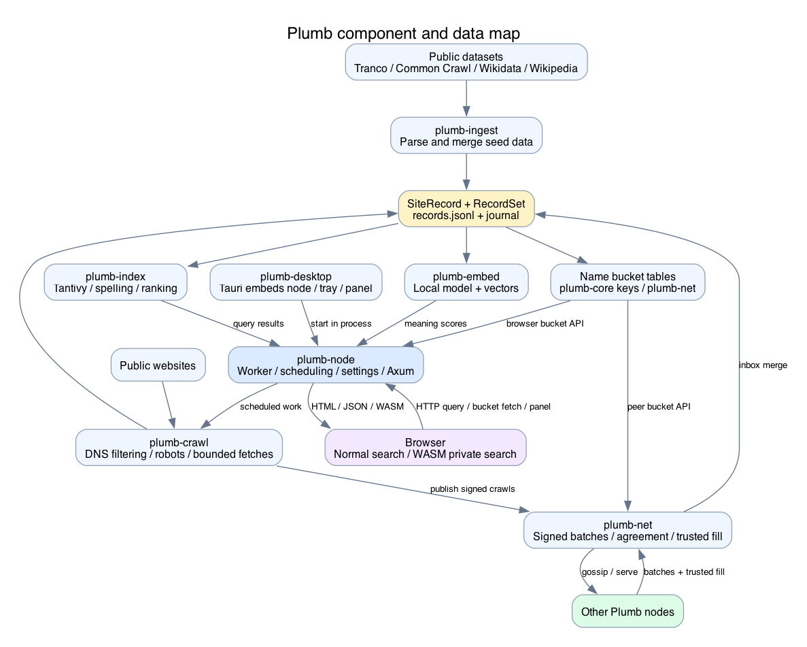
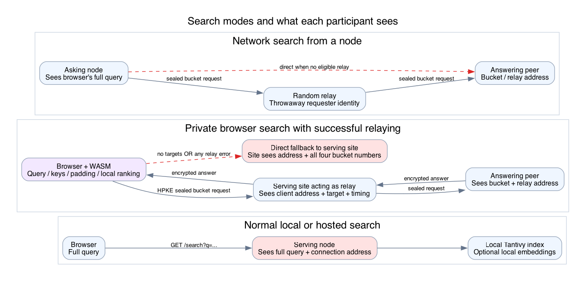
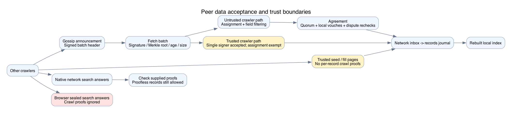
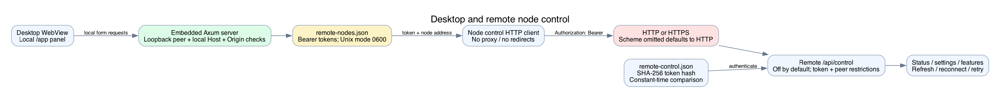

# Plumb architecture and data flows

This map explains the source code at main commit `7f7f7049bfcf400866b451ccd558174d835a3fa3`, fetched on October 4, 2026. Plumb is a local site-search pipeline with optional peer exchange and private browser retrieval. The desktop app embeds the node in its own process. A deployed node may use different flags or saved settings; this map is not an inventory of the running fleet.

The accompanying fixes require verified HTTPS for off-host desktop control, sanitize seed/fill result URLs and remove query-bearing diagnostic messages. This map and its diagrams retain the baseline behavior for reference; see the [review's fix status](privacy-security.md#fixes-following-this-review) and [control migration guide](../remote-control-security.md) for those changes.

## Component map

[Scalable diagram](diagrams/pipeline.svg) · [Editable Graphviz source](diagrams/pipeline.dot)

| Component | Responsibility | Code entry points |
| --- | --- | --- |
| plumb-core | SiteRecord, RecordSet, normalization, domain validation, name keys and shared encryption helpers | [lib.rs](../../crates/plumb-core/src/lib.rs), [keys.rs](../../crates/plumb-core/src/keys.rs), [oblivious.rs](../../crates/plumb-core/src/oblivious.rs) |
| plumb-ingest | Parse public seed datasets and merge metadata into site records | [lib.rs](../../crates/plumb-ingest/src/lib.rs), [builder.rs](../../crates/plumb-ingest/src/builder.rs), [download.rs](../../crates/plumb-ingest/src/download.rs) |
| plumb-crawl | Fetch homepages and icons, obey robots, extract names and links, filter DNS addresses | [crawl.rs](../../crates/plumb-crawl/src/crawl.rs), [dns.rs](../../crates/plumb-crawl/src/dns.rs), [extract.rs](../../crates/plumb-crawl/src/extract.rs) |
| plumb-index | Tantivy indexing, ranking, spelling, country and kind signals | [lib.rs](../../crates/plumb-index/src/lib.rs), [schema.rs](../../crates/plumb-index/src/schema.rs) |
| plumb-embed | Run the embedding model on the node and maintain site vectors | [model.rs](../../crates/plumb-embed/src/model.rs), [vectors.rs](../../crates/plumb-embed/src/vectors.rs) |
| plumb-net | libp2p transport, discovery, gossip, crawl acceptance, fill, search buckets, sealed relay requests, credits and popularity | [node.rs](../../crates/plumb-net/src/node.rs), [proto.rs](../../crates/plumb-net/src/proto.rs) |
| plumb-node | CLI, node lifecycle, worker scheduling, persistence, Axum search and management APIs | [run.rs](../../crates/plumb-node/src/run.rs), [node.rs](../../crates/plumb-node/src/node.rs), [worker.rs](../../crates/plumb-node/src/node/worker.rs), [web.rs](../../crates/plumb-node/src/web.rs) |
| plumb-private | WASM browser client, bucket retrieval, local ranking and sealed response handling | [browser.rs](../../crates/plumb-private/src/browser.rs), [rank.rs](../../crates/plumb-private/src/rank.rs), [sealed.rs](../../crates/plumb-private/src/sealed.rs) |
| plumb-desktop | Tauri window, tray, single instance, login startup and embedded node | [main.rs](../../crates/plumb-desktop/src/main.rs) |
| plumb-e2e | Container integration verification | [tests/docker.rs](../../crates/plumb-e2e/tests/docker.rs) |
| site and deployment files | Caddy public-route allowlist and Docker packaging | [Caddyfile](../../site/Caddyfile), [site compose](../../site/docker-compose.yml), [Dockerfile](../../Dockerfile) |

## Node lifecycle and persistence

The worker resumes from disk rather than replaying a single startup sequence. With no records it first tries a trusted network seed, when configured, then falls back to public seed downloads. The first network seed aims for 50,000 sites; it builds a first index and continues filling. Otherwise Tranco provides the quick start, followed by richer seed metadata. Crawling and received records update the records journal, and scheduled or requested work rebuilds the index. An opened replacement index becomes active while existing searches finish on the previous one. Optional embeddings are updated in the background. See [worker.rs](../../crates/plumb-node/src/node/worker.rs), [fill.rs](../../crates/plumb-node/src/node/fill.rs), [store.rs](../../crates/plumb-node/src/node/store.rs) and `ServingIndex` in [node.rs](../../crates/plumb-node/src/node.rs).

| Persisted data | Purpose and sensitivity |
| --- | --- |
| records.jsonl and its journal | Site records and crawl observations; normally public website data |
| numbered indexes and buckets | Local search index and hashed name-bucket tables |
| model and vectors | Downloaded model and locally computed embeddings |
| settings.json and features.json | Resource controls, optional features and trust configuration |
| net/node.key and credit files | Network identity and token material; secret-bearing files |
| net/batches, inbox, fill state and cache | Peer crawl data, pending merges, fill progress and cached search buckets |
| history/profile.json | Plaintext browser-specific queries and opened sites, when enabled |
| net/picks.json and reports | Local picks when sharing is enabled, and threshold-report data exchanged with peers |
| remote-control.json | Hash of this node's remote-control bearer token |
| remote-nodes.json and backups | Remote bearer tokens and recoverable identity material; sensitive |

Paths for network picks are defined by `PICKS_FILE` in [node/network.rs](../../crates/plumb-node/src/node/network.rs). Backup contents are explicitly allowlisted in [backup.rs](../../crates/plumb-node/src/node/backup.rs); history is not included.

## Search paths

[Scalable diagram](diagrams/search-privacy.svg) · [Editable source](diagrams/search-privacy.dot)

Normal search sends the complete query to the node through `/search` or `/api/search`. That node searches its own Tantivy index, optionally computes a query embedding locally, and can re-rank with history and aggregate popularity. A requested network search sends name-bucket requests to peers and ranks their answers on the asking node. The browser still sent its query to that asking node.

The `/private` client keeps the query in the URL fragment, derives keys, fetches four padded name buckets, and ranks records inside the browser. With successful relaying, bucket requests are sealed to answering peers. The serving site forwards them and sees the visitor connection. If target discovery or any sealed request fails, the client fetches the four buckets directly from the serving site. Those are different privacy states. See [web.rs](../../crates/plumb-node/src/web.rs), [net/search.rs](../../crates/plumb-net/src/search.rs), [browser.rs](../../crates/plumb-private/src/browser.rs) and [web/relay.rs](../../crates/plumb-node/src/web/relay.rs).

## Peer exchange and result authenticity

[Scalable diagram](diagrams/peer-sync.svg) · [Editable source](diagrams/peer-sync.dot)

libp2p uses TCP with Noise and Yamux, or QUIC. Bootstrap and Kademlia discover nodes, while relay reservations, hole punching, mDNS and UPnP provide optional routes. A permanent node key signs crawl batches. Gossip distributes their headers; recipients fetch batches and validate signatures, Merkle roots, age, assignment and permitted fields. Untrusted crawl observations go through agreement and local vouching. Trusted crawlers have a separate acceptance path, and trusted seed/fill transfers have no per-record crawl proofs. See [batch.rs](../../crates/plumb-net/src/batch.rs), [agree.rs](../../crates/plumb-net/src/agree.rs), [fill.rs](../../crates/plumb-net/src/fill.rs) and [net/node.rs](../../crates/plumb-net/src/node.rs).

Native network search checks supplied crawl proofs and also permits records without proofs. The WASM sealed client deliberately ignores crawl proofs. A signed observation establishes who supplied it and whether it was altered; it does not establish that its content is true.

## Desktop and remote control

[Scalable diagram](diagrams/remote-control.svg) · [Editable source](diagrams/remote-control.dot)

The desktop starts a node on loopback port 7586, choosing another port when needed. Its WebView shows the local panel; external web links go to the default browser. Local management checks the actual socket peer, local Host and browser Origin/fetch metadata. Remote node tokens are stored by the embedded server, which calls the remote control API. The remote API is disabled until configured, verifies a token hash in constant time, and normally permits only nearby addresses. Remote calls support both HTTP and HTTPS and disable redirects and system proxies. See [desktop/main.rs](../../crates/plumb-desktop/src/main.rs), [panel.rs](../../crates/plumb-node/src/web/panel.rs), [nodes.rs](../../crates/plumb-node/src/web/nodes.rs) and [control.rs](../../crates/plumb-node/src/web/control.rs).

The checked-in Caddy configuration exposes selected public search routes and keeps `/app` and `/api/control` outside its proxy allowlist. The generic Docker compose file publishes port 8080 to the host interfaces. These deployment choices change exposure without changing node code.

## Outbound data

| Destination | What leaves the computer | Trigger |
| --- | --- | --- |
| Seed providers and model host | Dataset/model download requests and source address | Setup, retries, optional meaning-search setup |
| Crawled websites and DNS resolver | Website hostname, HTTP requests and crawler address | Background crawl and favicon work |
| Bootstrap, discovery and connected peers | Node identity and connection metadata | Joining the network; desktop and Docker enable it by default |
| Peer data exchange | Signed crawl records, batch announcements, fill/cache requests | Network participation |
| Search relay | Connection address, target identity, sealed requests, size and timing | Relayed network/private search |
| Answering search peer | Bucket number; relay address or direct requester address | Bucket retrieval |
| Popularity peers | STARLite reports of selected query/domain pairs | Explicit popularity sharing |
| Remote managed node | Bearer token and control requests | Connecting to or managing that node |
| External search engine | Full query through a browser navigation | Explicit external link or bang such as !g |
| Chosen website | Browser navigation and visitor address | Opening a result |

Embedding inference is local; downloading the model does not send search queries to its host. Background crawling reveals the crawler's interests, but the inspected search path does not launch a homepage crawl for the user's typed query.

## Diagram maintenance

Each diagram has a Graphviz `.dot` source, a scalable SVG and a PNG preview. Regenerate with `dot -Tsvg INPUT.dot -o OUTPUT.svg` or `dot -Tpng INPUT.dot -o OUTPUT.png`. Update the source map when protocol, startup, trust or search-mode behavior changes. See the separate [privacy and security review](privacy-security.md) for demonstrated gaps and verification limits.
